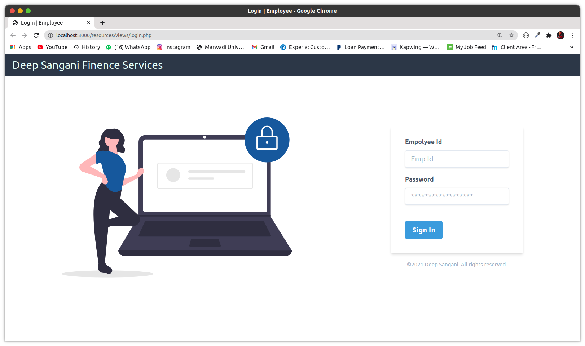
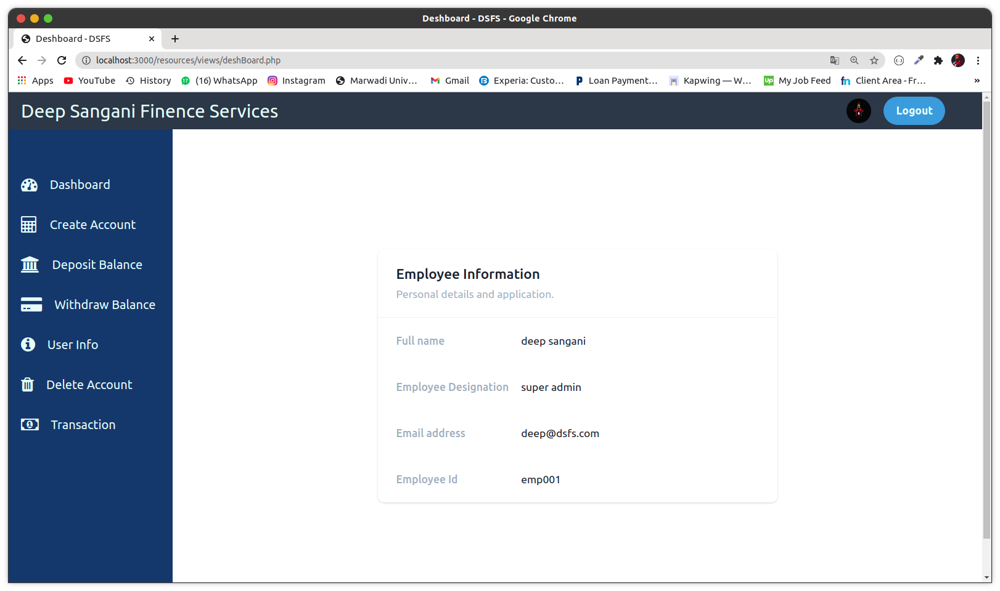
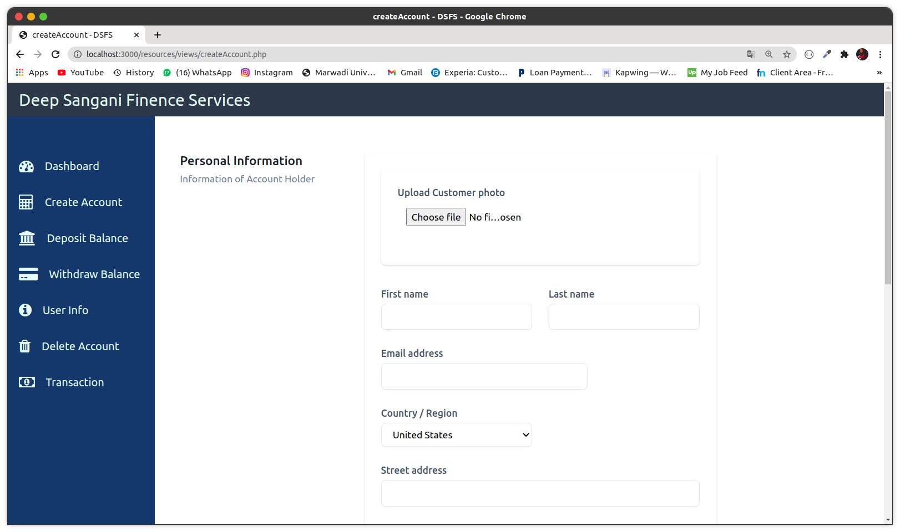
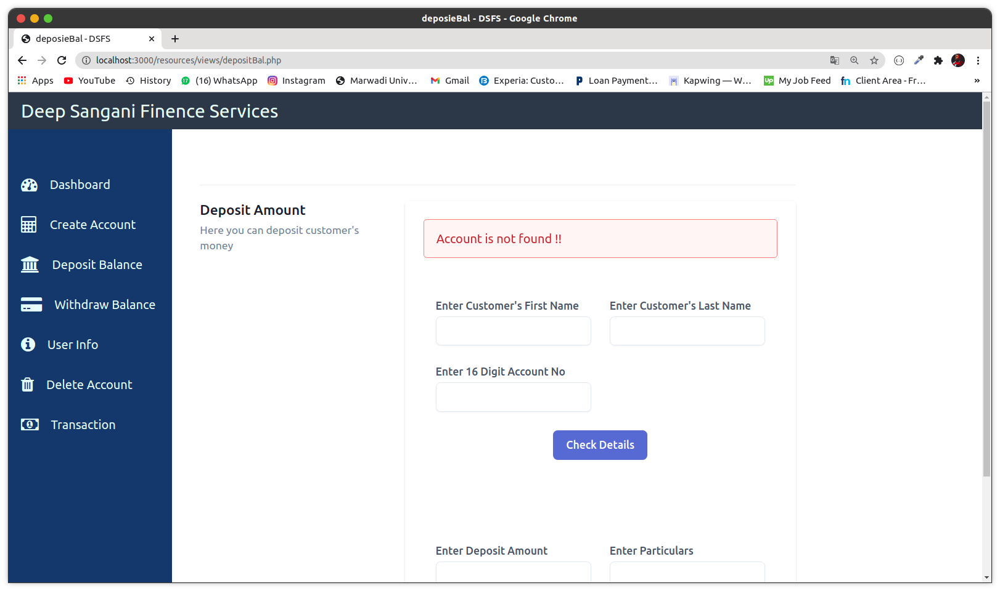
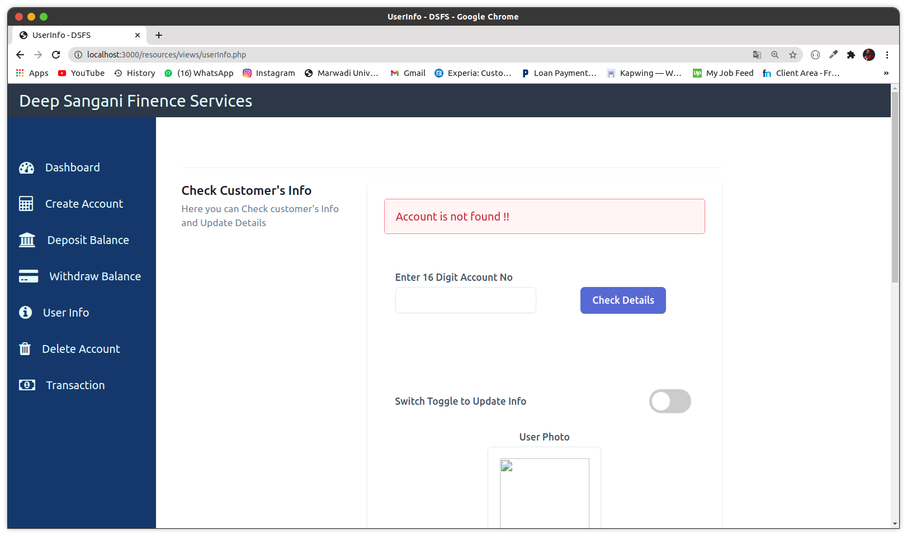
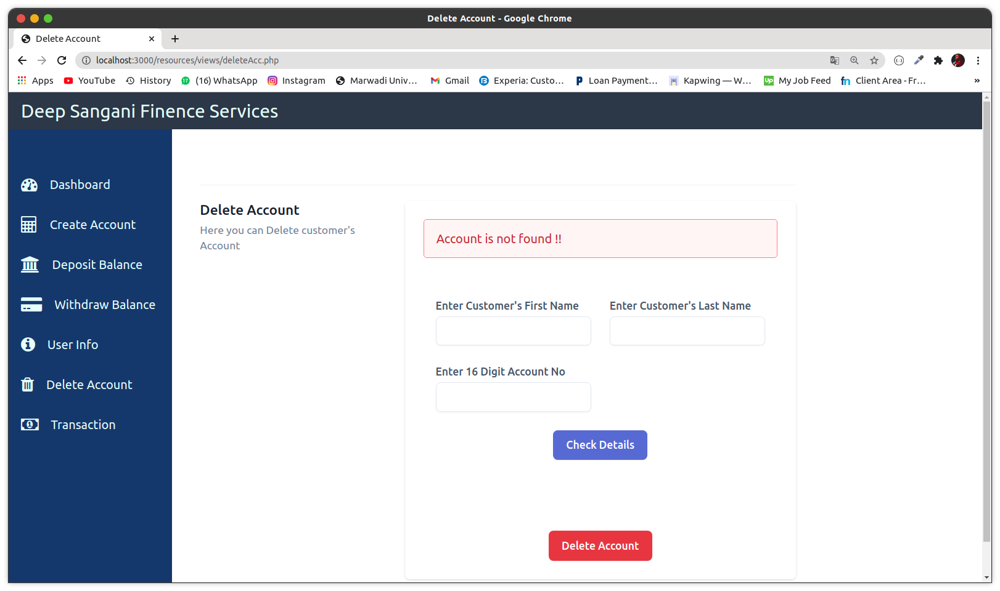
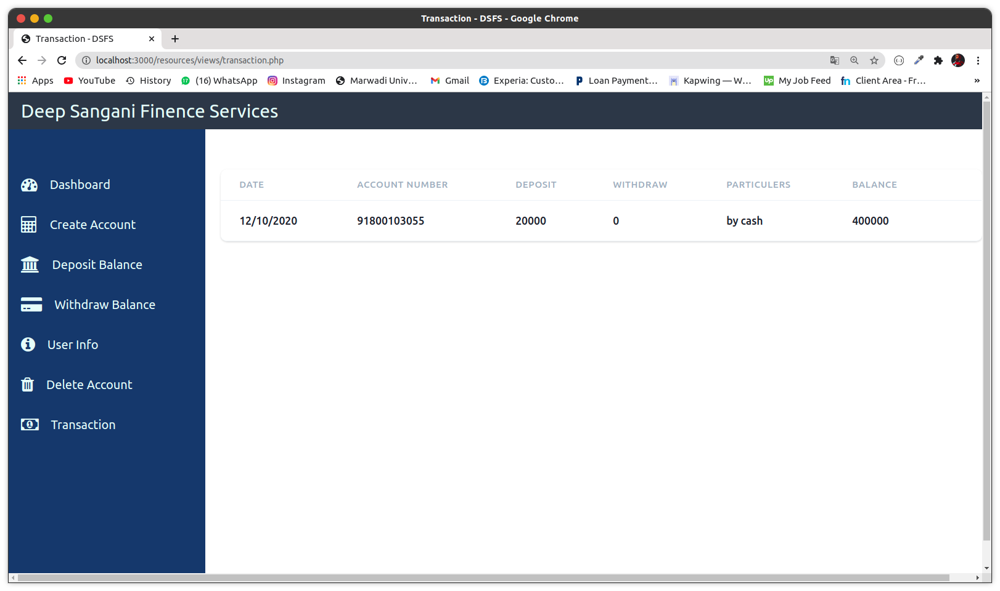

# bank management system for admin 
I made this project for my php web technology subject.
 
I used following technologies :-
- `telwind css` - for style
- `php` - for backend side and front end side also
- `html`- for structure my elements
- `mysql`- for database

---
## login page

---------

## dashboard page

-------
## create account page

---

## deposit balance page

---
## withdraw page

---
## userinfo page

---
## delete account page

---
## transaction page

---
> if anyone get error please kindly report it in issue section.
`thank you 🚀🚀🚀`